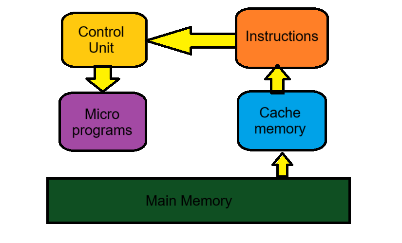
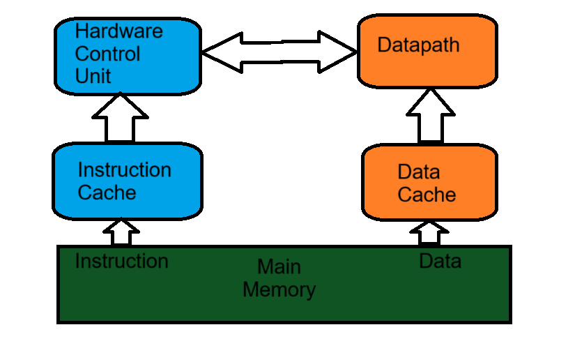

# CPU architectural types :
CPU Architecture operates the capacity to work.

#### Types :
1. CISC `(Complex Instruction Set Computing)`
Can execute addressing modes or multi-step operations within one instruction set.
2. RISC `(Reduced Instruction Set Computing)`
Has a simplified instruction set that gives a high performance.

## CISC Diagram

## RISC Diagram
