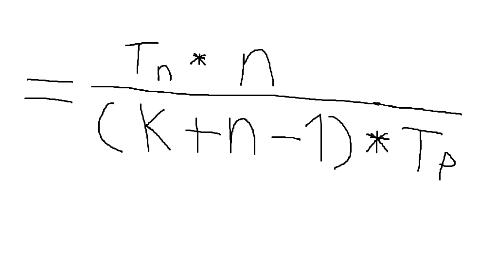

# Pipelining
Is the process of speedup the tasks and performance in computer architecture.
##### Image

## The Basic rule of Speedup

#### Definitions
1. `K` = Segments numbers
2. `Tp` = The Pipelined segements = Bigger number from all segments
3. `Tn` = The Non-Pipelined segements = Total of all numbers of segments
4. `N` = The given number in question

